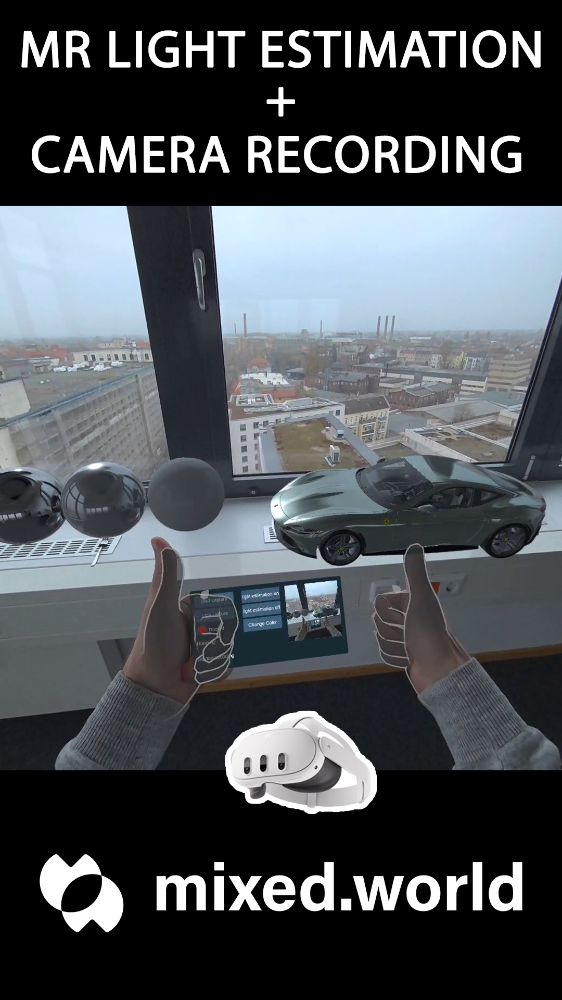

# MRRealLightCapture

**MRRealLightCapture** is a Unity-based solution designed for Meta Quest 3, utilizing real-time lighting estimation to create highly realistic and immersive Mixed Reality experiences. By leveraging the Meta Quest 3 Camera Access and Media Projection API, this tool blends real-world reflections with PBR lighting, adapting dynamically to environmental changes for believable 3D model rendering.

---

## Features

- **Real-World Reflections**: Blends real-world reflections with PBR lighting for natural integration of 3D models.
- **Adaptive Lighting**: Automatically adapts to new lighting conditions in real-time, enhancing visual plausibility.
- **Dynamic Cubemap Creation**: Generates a cubemap dynamically for realistic environmental mapping.
- **Camera Transition and Rotation Awareness**: Accurately stitches positional data based on camera transitions and rotation.
- **Directional Light Adjustment**: Calculates the brightest point in the cubemap for optimal directional lighting.

---
## Demo

[](https://youtube.com/shorts/TlzenHmJoWQ)

Watch the demo video to see Camera Passthrough + Realtime Light Estimation on Quest 3!

---
## Getting Started

### Prerequisites

- **Unity 2022.3.x or later**
- **Meta Quest 3** with Camera Access enabled via the Media Projection API
- **Meta SDK** and **Quest Integration Package** installed in Unity

### Installation

1. **Clone this repository**:
   ```bash
   git clone https://github.com/hellomixedworld/MRRealLightCapture.git
   ```
2. **Open Project via Unity Hub**
   Start Unity Hub and add the cloned project folder by clicking "Open" and browsing to the location of the folder.
   Switch the Platform to Android
3.  **Open the Sample Scene**
4. **Build and Run the Project on your Quest 3**  
   
